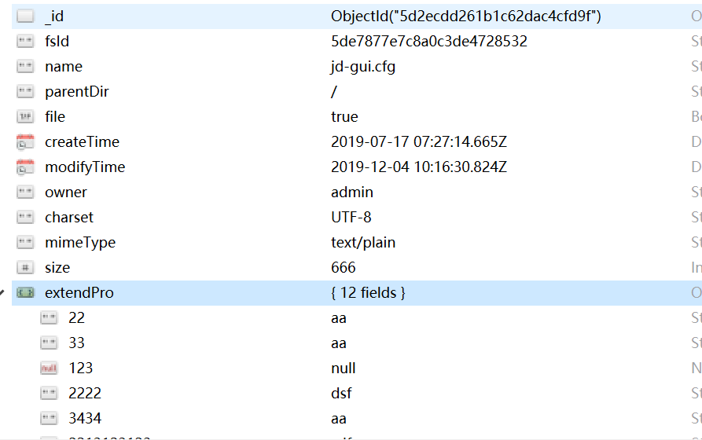
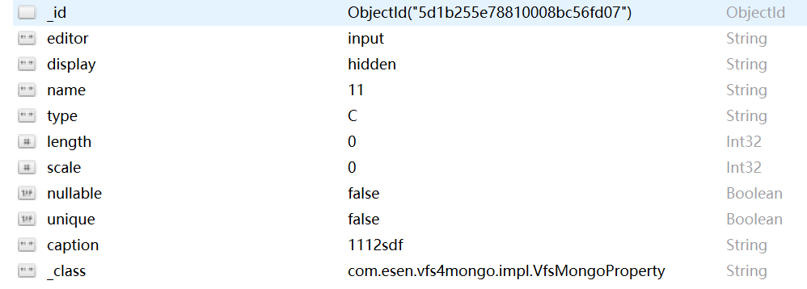

# 虚拟文件系统MongoDB数据库实现

## 功能描述

​	此工程主要是实现vfs工程定义的接口，实现对底层数据库的增删改查。

## 方案选型

### MongoDB优势

​	**①弱一致性（最终一致），更能保证用户的访问速度：**

​	**②文档结构的存储方式，能够更便捷的获取数据。**

​	**③内置GridFS，支持大容量的存储。**

​	**④内置Sharding。**

​	**⑤第三方支持丰富**

​	**⑥性能优越：**

### 持久层框架

​	**spring-data-mongodb**是官方提供的操作MongoDB框架，支持GridFs。

## 集成vfs工程

 	1. maven引入vfs
 	2. 添加类，继承AbstractVfsFile
 	3. 添加类PropertyServiceImpl，实现PropertyService
 	4. 添加类VfsMongoProperty，继承VfsExtendPropertyBean

## 数据库表设计

### vfs表

### 元数据表

### 索引

vfs表：  

         1. parentDir与name 复合索引（唯一）
   	     2.  parentDir  
   	     3.  name 

## 类设计

| 水电费              | 描述                                                         |
| ------------------- | ------------------------------------------------------------ |
| PropertyDao         | 元数据管理dao层                                              |
| VfsMongoProperty    | 针对mongodb数据库，需要拓展VfsExtendPropertyBean实体类       |
| VfsFile4Mongo       | 继承AbstractVfsFile，实现vfs类，是vfs对数据库层的操作实现    |
| PropertyServiceImpl | 元数据service实现类，实现PropertyService。                   |
| PathsThreadLocal    | MongoDB的事务需要用到threadlocal来存放当前线程创建了哪些文件。 |

